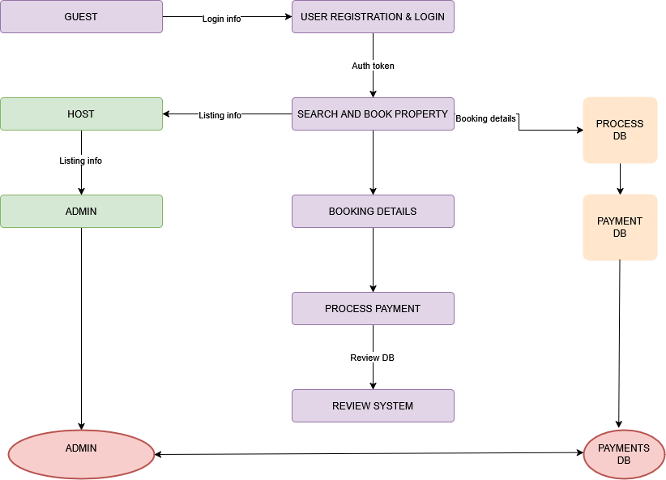

# Data Flow Diagram – Airbnb Clone Backend

This directory contains the Data Flow Diagram (DFD) for the Airbnb Clone backend. It illustrates how data flows through key components of the system, including:

- User registration and authentication
- Property listing and booking
- Payment processing
- Reviews and notifications

